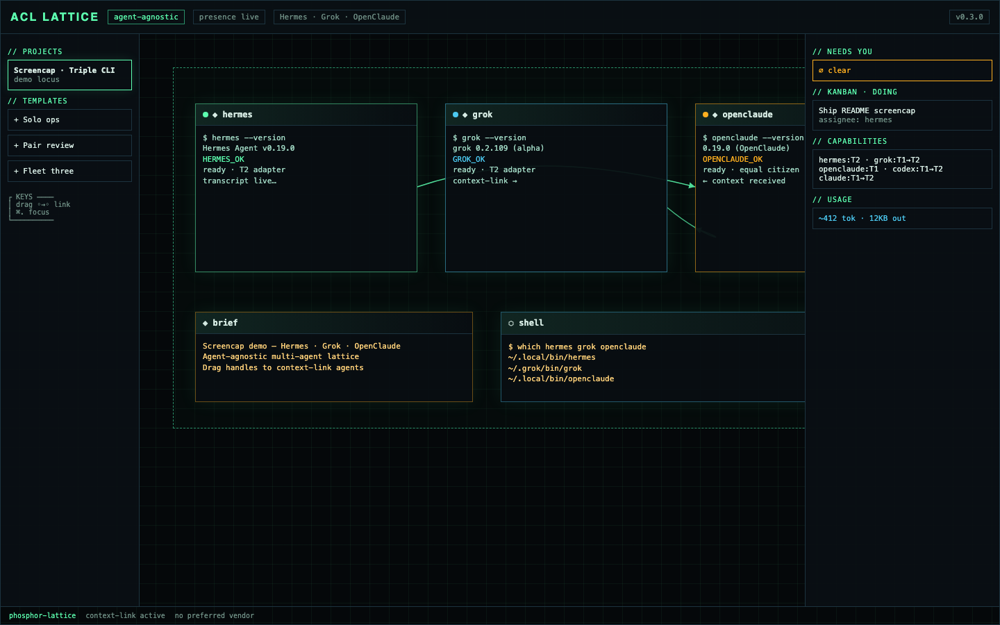
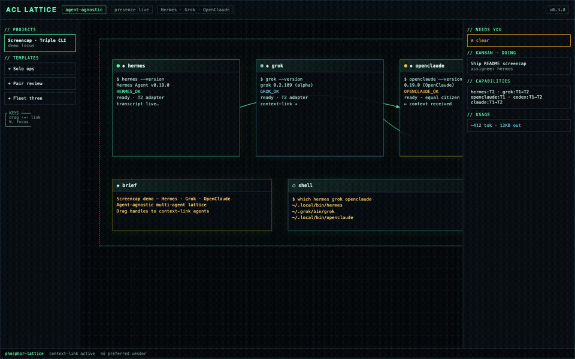
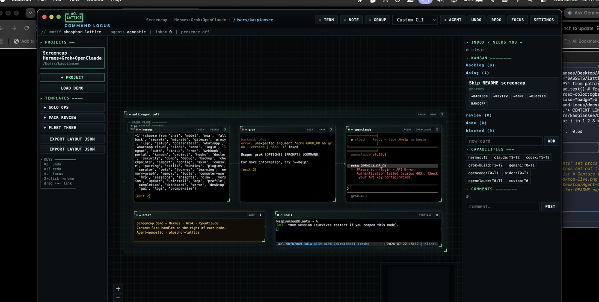

# Agent Command Locus (ACL)

**Spatial multi-agent command surface** — real terminals and heterogeneous agent CLIs on an infinite canvas.

```
╔═ ACL ═╗
║LATTICE║
╚═══════╝
```

> **v0.3.1 public beta** · MIT · **agent-agnostic** (Claude, Codex, Hermes, Grok, Gemini, OpenCode, OpenClaude, Aider, custom — equals)  
> Visual identity: **phosphor-lattice** (not another rounded-chat dashboard)

<p align="center">
  
</p>

<p align="center">
  
</p>

**Live desktop screencap** (Hermes · Grok · OpenClaude on one project):

<p align="center">
  
</p>

CLIs used in the capture (on PATH): `hermes` v0.19 · `grok` 0.2.x · `openclaude` 0.19.

## Why

Multi-agent work dies in tabs. ACL keeps agents, shells, notes, and Kanban **on one map**. When something needs you, you see which node. When two agents must collaborate, you **drag a context-link**.

## Features

- **Desktop (Electron)** — infinite canvas, node-pty terminals, tmux when available
- **Agent registry** — launch any first-party or custom CLI (T0–T2 adapters)
- **Kanban + NEEDS YOU inbox** — board cards + status bus
- **Context-link** — drag handle → handle injects source transcript into target PTY
- **Live transcript tail** + best-effort usage meter
- **Layout templates** — solo / pair-review / fleet-3 + JSON export/import
- **Server edition** — `http://127.0.0.1:8450/canvas` (WS PTY), `/m` mobile companion, presence
- **Desktop ↔ server presence** — optional `serverUrl` in Settings
- **Custom skins** — built-in aesthetics + user JSON in `skins/` ([docs/SKINS.md](docs/SKINS.md))

## Quickstart

**Requirements:** Node 20+, macOS recommended for desktop package; Linux/macOS for server.

```bash
git clone https://github.com/kaspianseehg/Agent-Command-Locus.git
cd Agent-Command-Locus
npm install
cd apps/desktop && npx @electron/rebuild -f -w node-pty && cd ../..
npm test && npm run secret-scan
npm run dev:desktop
```

Server (separate terminal):

```bash
npm run dev:server
# http://127.0.0.1:8450/           home
# http://127.0.0.1:8450/canvas    browser map + PTY
# http://127.0.0.1:8450/m         mobile companion
```

Optional env (see `.env.example`):

| Variable | Default | Notes |
|----------|---------|--------|
| `ACL_PORT` | `8450` | Server port |
| `ACL_BIND` | `127.0.0.1` | Use loopback unless you set a password |
| `ACL_SERVER_PASSWORD` | empty | **Set before non-loopback bind** |
| `ACL_DATA_DIR` | platform default | Shared JSON store path |
| `ACL_SERVER_URL` | — | Desktop presence bridge target |

### Package macOS

```bash
npm run package:mac
# → dist-package/*.zip and *.dmg (gitignored)
```

## Demo path (~2 minutes)

1. `npm run dev:desktop`
2. **load demo** → open a terminal node
3. Inspector → live transcript
4. Drag agent/term **handle → handle** for a context-link
5. Left rail → template **Pair review**
6. Optional: start server, Settings → server URL `http://127.0.0.1:8450`

## Monorepo layout

```
apps/desktop     Electron UI
apps/server      HTTP + WebSocket PTY + static pages
packages/shared  Types, agent presets
packages/core    Store, PTY, bus, templates, transcripts, links
packages/adapters T0–T2 per-CLI adapters
docs/            Architecture and subsystem docs
```

## Documentation

| Doc | Topic |
|-----|--------|
| [docs/README.md](docs/README.md) | Doc index |
| [docs/ARCHITECTURE.md](docs/ARCHITECTURE.md) | System shape |
| [docs/ADAPTERS.md](docs/ADAPTERS.md) | T0–T4 adapter model |
| [docs/AGENTS_AND_DEFAULTS.md](docs/AGENTS_AND_DEFAULTS.md) | Agent-agnostic policy |
| [docs/KANBAN.md](docs/KANBAN.md) | Board model |
| [docs/TEMPLATES.md](docs/TEMPLATES.md) | Shareable layouts |
| [docs/SKINS.md](docs/SKINS.md) | Custom skins / aesthetics |
| [docs/MAINTENANCE.md](docs/MAINTENANCE.md) | Automated maintenance (Coda + Hermes) |
| [docs/RELEASES.md](docs/RELEASES.md) | Releases & desktop packages |
| [docs/DATA_DIR.md](docs/DATA_DIR.md) | Data paths + lock |
| [docs/PORTS.md](docs/PORTS.md) | Default ports |
| [docs/SECURITY.md](docs/SECURITY.md) | Threat notes |
| [CHANGELOG.md](CHANGELOG.md) | Releases |
| [CONTRIBUTING.md](CONTRIBUTING.md) | PR / product stance |
| [SECURITY.md](SECURITY.md) | Vulnerability reporting |
| [LICENSE](LICENSE) | MIT |

## Scripts

| Command | Purpose |
|---------|---------|
| `npm run dev:desktop` | Electron app |
| `npm run dev:server` | Server on :8450 |
| `npm test` | Core + adapter tests |
| `npm run typecheck` | TypeScript |
| `npm run secret-scan` | Block accidental secrets |
| `npm run health` | Local health gate |
| `npm run package:mac` | macOS zip/dmg |
| `npm run release:check` | Probe if GitHub Release needed |
| `npm run release` | Tag + GitHub Release |
| `npm run release:packages` | Release + upload mac zip/dmg |

## Agent-agnostic policy

The product does **not** prefer or ban any vendor. Depth is **adapter tier** (T0 launch → T4 deep control), not brand. Disable agents you do not use in local Settings. See [docs/AGENTS_AND_DEFAULTS.md](docs/AGENTS_AND_DEFAULTS.md).

## Security

- No API keys in the repo
- PTY = full user shell — treat exposure accordingly
- Default bind is loopback; set `ACL_SERVER_PASSWORD` before wider bind

See [SECURITY.md](SECURITY.md).

## Roadmap

- Deeper T3–T4 adapters (structured events per CLI)
- Signed/notarized macOS releases
- Richer multiplayer (beyond presence)
- Full mobile canvas parity
- Windows desktop package

## License

[MIT](LICENSE) © 2026 Agent Command Locus contributors
